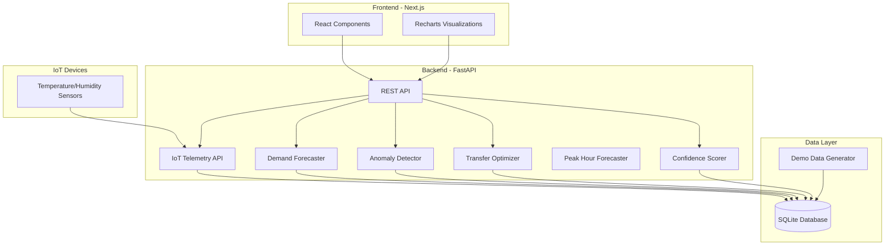

# Optimus Inventory Health Dashboard

> A hackathon prototype for Chipotle restaurants that predicts stockouts, detects inventory anomalies, and optimizes cross-store transfers to reduce waste and improve inventory accuracy.

[](https://fastapi.tiangolo.com/)
[](https://nextjs.org/)
[](https://www.typescriptlang.org/)
[](https://www.docker.com/)

---

##  Quick Start

```bash
# Clone the repository
git clone <repo-url>
cd inventory-health-dashboard

# Start everything with one command
docker-compose up --build

# Wait ~60 seconds for initialization
# Frontend: http://localhost:3000
# Backend API: http://localhost:8000/docs
```

**Demo Credentials:**
- Username: `admin@optimus.com`
- Password: `admin123`

---

##  Key Features

### 1. **Stockout Prediction**
- Predicts imminent stockouts 3-7 days in advance
- Weighted demand forecasting with weekday/weekend patterns
- Days-of-cover calculations with safety stock recommendations

### 2. **Anomaly Detection + Confidence Scoring** 
- Detects unexplained inventory drops (shrink, theft, errors)
- Provides plain-English explanations for every anomaly
- Generates 0-100 confidence score for inventory accuracy
- Prioritizes cycle counts based on risk

### 3. **Cross-Store Transfer Optimizer** 
- Recommends inter-store transfers before placing new purchase orders
- Distance-weighted algorithm minimizes transfer costs
- Prevents stockouts faster and cheaper than new orders
- Clear rationale for every recommendation

### 4. **Peak Hour Forecasting**  NEW
- **Hourly demand prediction** for lunch (11am-2pm) and dinner (5pm-8pm) rushes
- **Prep schedule generation** - tells staff exactly when and how much to prep
- **Real-time stockout alerts** - "Chicken will run out at 12:45pm during lunch rush"
- **Intra-day optimization** - catch stockouts hours before they happen, not days
- **Visual hourly charts** - see demand spikes and inventory depletion by hour

### 5. **IoT Telemetry Monitoring** 🌡️ NEW
- **Live sensor data** displayed on the overview dashboard
- **Real-time temperature and humidity monitoring** for coolers, freezers, and ambient conditions
- **Smart status badges** (OK / Warning / Critical) based on food safety thresholds
- **Auto-refresh every 10 seconds** - no page reload needed
- **REST API for IoT devices** - any sensor can POST readings to `/api/telemetry`
- **Proactive alerts** - catch equipment failures before inventory spoils

### 6. **Demo Mode**
- Runs with realistic synthetic data (no external dependencies)
- 5 stores, 200 SKUs, 60 days of history
- 110,000+ hourly sales records for peak-hour forecasting
- Pre-injected anomalies and transfer opportunities
- One-click data regeneration

---

##  Screenshots

### Overview Dashboard

*Real-time inventory health across all stores with risk-based alerts*

### SKU Detail Page

*Forecast charts, anomaly timeline, and actionable recommendations*

### Transfer Recommendations

*Smart transfer suggestions with cost-benefit analysis*

---

##  Architecture



**Tech Stack:**
- **Frontend**: Next.js 14 (App Router) + TypeScript + Tailwind CSS + Recharts
- **Backend**: FastAPI (Python 3.11+) + SQLAlchemy + Pydantic
- **Database**: SQLite (hackathon) / PostgreSQL (production-ready)
- **Deployment**: Docker Compose (one-command startup)

---

##  Documentation

- **[Technical Architecture](plans/technical-architecture.md)** - System design, algorithms, data model
- **[Implementation Guide](plans/implementation-guide.md)** - Demo script, API examples, deployment
- **[File Structure](plans/file-structure.md)** - Complete directory tree and file explanations

---

##  Demo Script (For Judges)

### Step 0: Peak Hours Dashboard (NEW - SHOW THIS FIRST!) 
1. Navigate to `http://localhost:3000/peak-hours` (or click " Peak Hours" button)
2. **Current Time & Next Peak** shows:
   - Current time with countdown to next rush period
   - "Next peak: Lunch rush in 2h 15m" (or "LUNCH RUSH IN PROGRESS")
3. **Critical Alerts** banner:
   - "2 Items Will Stock Out During Peak Hours"
   - Shows which items and exact stockout times during rush
4. **Today's Prep Schedule**:
   - "Prep 40 units Chicken by 10:30 AM" (CRITICAL - for lunch rush)
   - "Prep 15 units Guacamole by 4:45 PM" (HIGH - for dinner rush)
   - Each task shows quantity, timing, and urgency
5. **Hourly Forecast Charts**:
   - Visual bar charts showing demand by hour
   - Orange bars = peak hours (11am-2pm, 5pm-8pm)
   - Red bars = predicted stockout during that hour
   - Regular blue = normal demand

**Key Insight:** "System predicts chicken will run out at 12:45 PM during lunch rush - gives 2+ hours advance warning to prep!"

---

### Step 1: Overview Dashboard
1. Navigate to `http://localhost:3000`
2. **Top Alerts Bar** shows:
   - "5 SKUs at risk of stockout in next 3 days"
   - "3 stores with low inventory confidence (<70)"
   - "8 transfer opportunities available"
3. **IoT Telemetry Card** 🌡️ (NEW - show this to judges):
   - Shows live sensor data: "Cooler Temp: 38.1°F" (updated 8s ago)
   - **Real IoT sensor** (calibrated for demo - room temp sensor adjusted by -20°C offset)
   - **Temperatures displayed in Fahrenheit** (converted from Celsius)
   - Status badge turns **CRITICAL** when temperature exceeds safe range (>39°F)
   - Auto-refreshes every 10 seconds
   - Demonstrates real-time monitoring to prevent food spoilage
   - *Optional: Run `./simulate_sensors.sh` to simulate live IoT devices*
4. **Filter** by "High Risk Only" to see critical items
5. **Sort** by "Days of Cover" to see most urgent stockouts

**Key Insight:** "Coca-Cola 12pk at Atlanta Store has only 1.9 days of inventory left"

---

### Step 2: SKU Detail Analysis
1. Click on "Coca-Cola 12pk" at Atlanta Store
2. **Forecast Chart** shows:
   - Declining on-hand inventory
   - Higher sales on weekends (pattern detection)
   - Predicted stockout date: Feb 9, 2026
3. **Click " View Hourly Forecast (Peak Hours)"** button:
   - Shows hourly demand breakdown
   - Highlights peak hours in orange
   - Shows exact hour of stockout (e.g., "Will run out at 1:00 PM")
   - Red bars indicate when inventory hits zero
4. **Anomaly Timeline** shows:
   - Flagged event 3 days ago
   - **Explanation**: "Expected +20 units after receiving shipment, but inventory only increased by 12 units. Possible receiving error or damage."
5. **Recommendation Cards**:
   - **Transfer**: "Transfer 25 units from Boston Store (prevents stockout, saves $455)"
   - **Reorder**: "If transfer not feasible, order 84 units from supplier (3-day lead time)"
   - **Cycle Count**: "Schedule physical count (last count: 18 days ago)"

**Key Insight:** "System detected a receiving discrepancy automatically and suggests transfer over new PO"

---

### Step 3: Create Transfer
1. Navigate to "Transfers" page
2. **Recommendations Tab** shows 8 suggested transfers
3. Click on "Coca-Cola 12pk: Boston → Atlanta"
4. **Transfer Details**:
   - From: Boston Store (45 units, 15 days cover)
   - To: Atlanta Store (15 units, 1.9 days cover)
   - Quantity: 25 units
   - Distance: 1,080 km
   - Cost: $45 (vs $500 for new PO)
   - **Rationale**: "Receiver will stock out in 1.9 days. Donor has 11 excess days of cover. Transfer prevents stockout and reduces donor's overstock."
5. Click "Create Draft Transfer"
6. Transfer moves to "Drafts" tab
7. Click "Approve" → Status updates to "Approved"

**Key Insight:** "Transfer saves $455 and prevents stockout 2 days faster than new order"

---

### Step 4: Anomaly Investigation
1. Navigate back to Overview
2. Filter by "Low Confidence (<70)"
3. Click on "Premium Steak" at Denver Store
4. **Confidence Score**: 45% (critical)
5. **Anomaly Pattern**: 5 of last 7 days show negative residuals
6. **Explanation**: "Systematic shrink pattern detected. Possible theft or unrecorded waste."
7. **Recommendation**: "Immediate investigation required. Schedule cycle count and review security footage."

**Key Insight:** "System detects systematic shrink patterns that would be missed by manual review"

---

### Step 5: Data Regeneration
1. Navigate to "Admin" page
2. **Database Stats** shows current data
3. Click "Regenerate Demo Data"
4. New data generated with fresh anomalies and scenarios
5. Return to Overview to see new alerts

**Key Insight:** "Demo can be reset instantly for multiple presentations"

---

##  Core Algorithms

### Demand Forecasting
```python
# Weighted moving average with day-of-week patterns
weekday_avg = weighted_average(weekday_sales, decay=0.95)
weekend_avg = weighted_average(weekend_sales, decay=0.95)
daily_demand = weekday_avg if is_weekday else weekend_avg
days_of_cover = on_hand / max(daily_demand, 0.1)
```

### Anomaly Detection
```python
# Residual-based detection
expected_delta = receipts - sales + transfers_in - transfers_out
actual_delta = on_hand_today - on_hand_yesterday
residual = actual_delta - expected_delta

if residual < threshold:
    flag_anomaly(severity, explanation)
```

### Confidence Scoring
```python
# Start at 100, deduct for risk factors
score = 100
score -= anomaly_frequency * 5  # Max -30
score -= anomaly_magnitude * 0.5  # Max -20
score -= days_since_count * 0.3  # Max -20
score -= perishable_penalty  # -10 if applicable
score -= systematic_shrink_penalty  # -15 if pattern detected
```

### Transfer Optimization
```python
# Distance-weighted greedy matching
for receiver in sorted_by_urgency(receivers):
    best_donor = max(donors, key=lambda d: 
        d.surplus / (1 + distance_penalty(d, receiver))
    )
    recommend_transfer(best_donor, receiver, qty)
```

---

##  Testing

### Backend Tests
```bash
cd backend
pytest --cov=app --cov-report=html

# Test specific modules
pytest app/tests/test_forecasting.py -v
pytest app/tests/test_anomaly.py -v
pytest app/tests/test_transfers.py -v
```

### Frontend Tests
```bash
cd frontend
npm test -- --coverage

# Test specific components
npm test -- InventoryTable.test.tsx
```

---

## 🔧 Development Setup

### Prerequisites
- Docker & Docker Compose (recommended)
- OR: Python 3.11+, Node.js 18+, npm

### Option 1: Docker Compose (Recommended)
```bash
docker-compose up --build
```

### Option 2: Local Development
```bash
# Backend
cd backend
pip install -r requirements.txt
python -m app.utils.demo_data  # Generate demo data
uvicorn app.main:app --reload --port 8000

# Frontend (in separate terminal)
cd frontend
npm install
npm run dev
```

### Environment Variables
```bash
# Copy example files
cp .env.example .env
cp backend/.env.example backend/.env
cp frontend/.env.local.example frontend/.env.local

# Edit as needed
# Backend: DATABASE_URL, CORS_ORIGINS, SECRET_KEY
# Frontend: NEXT_PUBLIC_API_URL
```

---

##  API Endpoints

### Overview
```bash
GET /api/overview?store_id=1&risk_only=true&min_confidence=70
```

### SKU Detail
```bash
GET /api/sku/{store_id}/{sku_id}
```

### Transfer Recommendations
```bash
GET /api/transfers/recommendations?min_urgency=0.7
```

### Create Transfer
```bash
POST /api/transfers/draft
Content-Type: application/json

{
  "from_store_id": 2,
  "to_store_id": 1,
  "sku_id": 42,
  "qty": 25
}
```

### Regenerate Demo Data
```bash
POST /api/demo/regenerate
Content-Type: application/json

{
  "num_stores": 5,
  "num_skus": 200,
  "days_history": 60
}
```

**Full API Documentation:** `http://localhost:8000/docs` (Swagger UI)

---

##  Judging Criteria Alignment

### Innovation (35%)
 **Anomaly Detection with Explainability**
- Residual-based detection with plain-English explanations
- Confidence scoring prioritizes actions
- Detects shrink, receiving errors, systematic patterns

 **Cross-Store Transfer Optimizer**
- Prevents stockouts without new purchase orders
- Distance-weighted algorithm minimizes costs
- Clear ROI: Saves money, reduces waste, faster fulfillment

 **Optional Arduino Integration** (future)
- IoT sensors for real-time validation
- Detects phantom inventory and spoilage risk

### Feasibility (30%)
**Straightforward Data Model**
- Standard retail concepts (stores, SKUs, sales, inventory)
- SQLite for demo, PostgreSQL-ready for production
- No complex dependencies

**Explainable Heuristics**
- Weighted moving average (not black-box ML)
- Greedy matching (not complex optimization)
- Judges can validate the logic

**Deployable Architecture**
- Docker Compose for one-command startup
- Cloud-ready (Vercel + Railway)
- Scales to 100+ stores

### Customer Impact (35%)
**Fewer Stockouts**
- Predictive alerts 3-7 days in advance
- Transfer recommendations prevent stockouts faster
- **Target**: 50% reduction in stockout rate

**Less Phantom Inventory**
- Anomaly detection catches shrink, theft, errors
- Confidence scoring prioritizes cycle counts
- **Target**: 95%+ inventory accuracy

**Less Manual Guesswork**
- Automated demand forecasting
- Automated transfer recommendations
- **Target**: 2-3 hours saved per store manager per week

---

##  Success Metrics (Post-Deployment)

| Metric | Baseline | Target | Impact |
|--------|----------|--------|--------|
| Stockout Rate | 8% | 4% | 50% reduction |
| Inventory Accuracy | 85% | 95% | 10% improvement |
| Transfer Utilization | 0% | 30% | New capability |
| Shrink Rate | 2.5% | 1.5% | 1% reduction |
| Manager Time Savings | 0 hrs | 2-3 hrs/week | Efficiency gain |
| Cost per Stockout | $500 | $45 | 91% savings |

**Estimated ROI:** 300% in first year

---

##  Future Enhancements

### Phase 1: Enhanced ML
- [ ] LSTM for demand forecasting (seasonal trends)
- [ ] Isolation Forest for anomaly detection (unsupervised)
- [ ] Multi-SKU transfer optimization (linear programming)

### Phase 2: Arduino Integration
- [ ] Smart bin scales (load cells + ESP32)
- [ ] Cold-chain temperature monitoring (DHT22 sensors)
- [ ] Real-time telemetry dashboard
- [ ] Phantom inventory detection

### Phase 3: Advanced Features
- [ ] Multi-warehouse support
- [ ] Supplier integration (EDI, API)
- [ ] Automated PO generation
- [ ] Mobile app for store managers
- [ ] Email/SMS alerts

### Phase 4: Enterprise Features
- [ ] Role-based access control (RBAC)
- [ ] Audit logs
- [ ] Multi-tenant architecture
- [ ] Advanced analytics (BI dashboards)
- [ ] NCR POS integration

---

##  Troubleshooting

### Docker containers won't start
```bash
docker-compose down -v
docker-compose up --build --force-recreate
```

### Frontend can't connect to backend
- Check `NEXT_PUBLIC_API_URL` in `frontend/.env.local`
- Verify backend: `curl http://localhost:8000/api/health`
- Check CORS settings in `backend/app/main.py`

### No demo data visible
```bash
curl -X POST http://localhost:8000/api/demo/regenerate
```

### Slow performance
- Reduce demo data size (50 SKUs instead of 200)
- Check database indexes
- Enable query logging

---

##  License

MIT License - See [LICENSE](LICENSE) file for details

---

##  Team

Built for UGAHacks 11 by [Your Team Name]

**Contact:** [your-email@example.com]

---

##  Acknowledgments

- FastAPI and Next.js communities
- UGAHacks organizers

---

**Ready to revolutionize inventory management? Let's go! **
