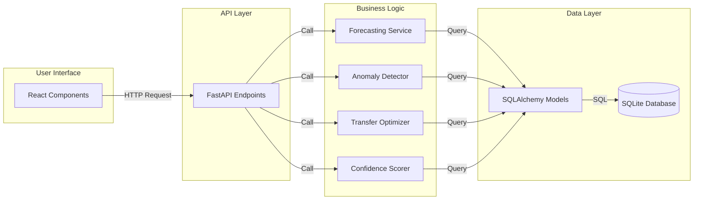

# Project File Structure

## Complete Directory Tree

```
inventory-health-dashboard/
│
├── README.md                           # Main documentation with quick start
├── docker-compose.yml                  # One-command deployment
├── .env.example                        # Environment variables template
├── .gitignore                          # Git ignore rules
│
├── plans/                              # Architecture & planning docs
│   ├── technical-architecture.md       # System design & algorithms
│   ├── implementation-guide.md         # Demo script & deployment
│   └── file-structure.md              # This file
│
├── backend/                            # FastAPI Python backend
│   ├── Dockerfile                      # Backend container config
│   ├── requirements.txt                # Python dependencies
│   ├── pytest.ini                      # Test configuration
│   ├── .env.example                    # Backend env template
│   │
│   ├── app/
│   │   ├── __init__.py
│   │   ├── main.py                     # FastAPI app entry point
│   │   ├── config.py                   # Configuration management
│   │   ├── database.py                 # SQLAlchemy setup & session
│   │   │
│   │   ├── models/                     # SQLAlchemy ORM models
│   │   │   ├── __init__.py
│   │   │   ├── store.py                # Store model
│   │   │   ├── sku.py                  # SKU model
│   │   │   ├── inventory.py            # InventorySnapshot model
│   │   │   ├── sales.py                # SalesDaily model
│   │   │   ├── receipt.py              # ReceiptsDaily model
│   │   │   ├── transfer.py             # Transfer model
│   │   │   ├── cycle_count.py          # CycleCount model
│   │   │   ├── supplier.py             # Supplier & SkuSupplier models
│   │   │   ├── anomaly.py              # AnomalyEvent model
│   │   │   └── recommendation.py       # TransferRecommendation model
│   │   │
│   │   ├── schemas/                    # Pydantic request/response models
│   │   │   ├── __init__.py
│   │   │   ├── store.py                # Store schemas
│   │   │   ├── sku.py                  # SKU schemas
│   │   │   ├── inventory.py            # Inventory state schemas
│   │   │   ├── transfer.py             # Transfer schemas
│   │   │   ├── overview.py             # Overview/dashboard schemas
│   │   │   ├── anomaly.py              # Anomaly schemas
│   │   │   └── auth.py                 # Auth schemas
│   │   │
│   │   ├── api/                        # API route handlers
│   │   │   ├── __init__.py
│   │   │   ├── overview.py             # GET /api/overview
│   │   │   ├── sku.py                  # GET /api/sku/{store_id}/{sku_id}
│   │   │   ├── transfers.py            # Transfer endpoints
│   │   │   ├── demo.py                 # Demo data management
│   │   │   └── auth.py                 # Mock authentication
│   │   │
│   │   ├── services/                   # Business logic layer
│   │   │   ├── __init__.py
│   │   │   ├── forecasting.py          # Demand forecasting engine
│   │   │   ├── anomaly_detector.py     # Anomaly detection logic
│   │   │   ├── confidence_scorer.py    # Confidence scoring
│   │   │   ├── transfer_optimizer.py   # Transfer recommendation engine
│   │   │   └── inventory_service.py    # Inventory calculations
│   │   │
│   │   ├── utils/                      # Utility functions
│   │   │   ├── __init__.py
│   │   │   ├── demo_data.py            # Demo data generator
│   │   │   ├── distance.py             # Distance calculations
│   │   │   └── date_utils.py           # Date/time helpers
│   │   │
│   │   └── tests/                      # Unit & integration tests
│   │       ├── __init__.py
│   │       ├── conftest.py             # Pytest fixtures
│   │       ├── test_forecasting.py     # Forecast tests
│   │       ├── test_anomaly.py         # Anomaly detection tests
│   │       ├── test_transfers.py       # Transfer optimizer tests
│   │       ├── test_confidence.py      # Confidence scoring tests
│   │       └── test_api.py             # API endpoint tests
│   │
│   └── data/                           # SQLite database storage
│       ├── .gitkeep
│       └── inventory.db                # Generated at runtime
│
└── frontend/                           # Next.js React frontend
    ├── Dockerfile                      # Frontend container config
    ├── package.json                    # Node dependencies
    ├── package-lock.json               # Locked dependencies
    ├── tsconfig.json                   # TypeScript config
    ├── tailwind.config.ts              # Tailwind CSS config
    ├── next.config.js                  # Next.js config
    ├── postcss.config.js               # PostCSS config
    ├── .env.local.example              # Frontend env template
    ├── .eslintrc.json                  # ESLint config
    │
    ├── public/                         # Static assets
    │   ├── logo.svg                    # NCR Voyix logo
    │   └── favicon.ico                 # Favicon
    │
    ├── src/
    │   ├── app/                        # Next.js App Router pages
    │   │   ├── layout.tsx              # Root layout with nav
    │   │   ├── page.tsx                # Overview dashboard (/)
    │   │   ├── globals.css             # Global styles
    │   │   │
    │   │   ├── sku/                    # SKU detail routes
    │   │   │   └── [storeId]/
    │   │   │       └── [skuId]/
    │   │   │           └── page.tsx    # SKU detail page
    │   │   │
    │   │   ├── transfers/              # Transfers routes
    │   │   │   └── page.tsx            # Transfers page
    │   │   │
    │   │   └── admin/                  # Admin routes
    │   │       └── page.tsx            # Data admin page
    │   │
    │   ├── components/                 # React components
    │   │   │
    │   │   ├── ui/                     # Reusable UI primitives
    │   │   │   ├── Button.tsx          # Button component
    │   │   │   ├── Card.tsx            # Card container
    │   │   │   ├── Badge.tsx           # Status badge
    │   │   │   ├── Table.tsx           # Data table
    │   │   │   ├── Input.tsx           # Form input
    │   │   │   ├── Select.tsx          # Dropdown select
    │   │   │   ├── Modal.tsx           # Modal dialog
    │   │   │   ├── Spinner.tsx         # Loading spinner
    │   │   │   └── Alert.tsx           # Alert message
    │   │   │
    │   │   ├── layout/                 # Layout components
    │   │   │   ├── Navbar.tsx          # Top navigation
    │   │   │   ├── Sidebar.tsx         # Side navigation (optional)
    │   │   │   └── Footer.tsx          # Footer
    │   │   │
    │   │   ├── dashboard/              # Overview page components
    │   │   │   ├── AlertsBar.tsx       # Top alerts banner
    │   │   │   ├── InventoryTable.tsx  # Main inventory table
    │   │   │   ├── Filters.tsx         # Filter controls
    │   │   │   ├── StatsCards.tsx      # Summary statistics
    │   │   │   └── RiskBadge.tsx       # Risk level indicator
    │   │   │
    │   │   ├── sku/                    # SKU detail components
    │   │   │   ├── ForecastChart.tsx   # Forecast line chart
    │   │   │   ├── AnomalyTimeline.tsx # Anomaly bar chart
    │   │   │   ├── RecommendationCard.tsx # Action card
    │   │   │   ├── ConfidenceScore.tsx # Confidence display
    │   │   │   └── MetricsGrid.tsx     # Key metrics grid
    │   │   │
    │   │   ├── transfers/              # Transfers page components
    │   │   │   ├── TransferList.tsx    # Recommendations list
    │   │   │   ├── TransferCard.tsx    # Single transfer card
    │   │   │   ├── TransferModal.tsx   # Create/edit modal
    │   │   │   ├── StatusBadge.tsx     # Transfer status
    │   │   │   └── WorkflowDiagram.tsx # Status workflow
    │   │   │
    │   │   └── admin/                  # Admin page components
    │   │       ├── DemoDataForm.tsx    # Data generator form
    │   │       ├── StatsDisplay.tsx    # Database statistics
    │   │       └── UserList.tsx        # Mock users list
    │   │
    │   ├── lib/                        # Utilities & helpers
    │   │   ├── api.ts                  # API client functions
    │   │   ├── types.ts                # TypeScript type definitions
    │   │   ├── utils.ts                # General utilities
    │   │   ├── constants.ts            # App constants
    │   │   └── formatters.ts           # Data formatters
    │   │
    │   └── hooks/                      # Custom React hooks
    │       ├── useInventory.ts         # Inventory data hook
    │       ├── useTransfers.ts         # Transfers data hook
    │       ├── useSKU.ts               # SKU detail hook
    │       └── useAuth.ts              # Auth hook (mock)
    │
    └── __tests__/                      # Frontend tests
        ├── components/
        │   ├── InventoryTable.test.tsx
        │   └── TransferCard.test.tsx
        └── lib/
            └── api.test.ts
```

---

## Key Files Explained

### Backend Core Files

#### [`backend/app/main.py`](backend/app/main.py)
FastAPI application entry point. Sets up:
- CORS middleware
- API routers
- Database initialization
- Health check endpoint
- OpenAPI documentation

#### [`backend/app/database.py`](backend/app/database.py)
Database configuration:
- SQLAlchemy engine setup
- Session management
- Base model class
- Database initialization function

#### [`backend/app/services/forecasting.py`](backend/app/services/forecasting.py)
Demand forecasting engine:
- `calculate_demand_forecast()` - Weighted moving average
- `get_weekday_weekend_pattern()` - Day-of-week analysis
- `calculate_days_of_cover()` - Inventory coverage
- `predict_stockout_date()` - Stockout prediction

#### [`backend/app/services/anomaly_detector.py`](backend/app/services/anomaly_detector.py)
Anomaly detection logic:
- `detect_anomalies()` - Residual-based detection
- `classify_severity()` - Severity classification
- `generate_explanation()` - Plain-English explanations
- `find_anomaly_patterns()` - Pattern detection

#### [`backend/app/services/confidence_scorer.py`](backend/app/services/confidence_scorer.py)
Confidence scoring:
- `calculate_confidence_score()` - Main scoring function
- `get_anomaly_penalty()` - Anomaly deductions
- `get_cycle_count_penalty()` - Count recency deductions
- `get_perishable_penalty()` - Perishable item deductions

#### [`backend/app/services/transfer_optimizer.py`](backend/app/services/transfer_optimizer.py)
Transfer recommendation engine:
- `generate_transfer_recommendations()` - Main optimizer
- `find_best_donor()` - Distance-weighted donor selection
- `calculate_urgency()` - Urgency scoring
- `generate_rationale()` - Explanation generation

#### [`backend/app/utils/demo_data.py`](backend/app/utils/demo_data.py)
Demo data generator:
- `generate_demo_data()` - Main generation function
- `create_stores()` - Store creation with locations
- `create_skus()` - SKU creation with categories
- `generate_sales_history()` - Realistic sales patterns
- `inject_anomalies()` - Anomaly injection
- `create_transfer_scenarios()` - Transfer opportunities

---

### Frontend Core Files

#### [`frontend/src/app/page.tsx`](frontend/src/app/page.tsx)
Overview dashboard page:
- Fetches inventory overview data
- Displays alerts bar
- Renders inventory table with filters
- Handles sorting and filtering

#### [`frontend/src/app/sku/[storeId]/[skuId]/page.tsx`](frontend/src/app/sku/[storeId]/[skuId]/page.tsx)
SKU detail page:
- Fetches SKU-specific data
- Displays forecast chart
- Shows anomaly timeline
- Renders recommendation cards

#### [`frontend/src/app/transfers/page.tsx`](frontend/src/app/transfers/page.tsx)
Transfers page:
- Fetches transfer recommendations
- Displays transfer list with tabs
- Handles transfer creation
- Shows workflow status

#### [`frontend/src/components/dashboard/InventoryTable.tsx`](frontend/src/components/dashboard/InventoryTable.tsx)
Main inventory table component:
- Sortable columns
- Color-coded risk levels
- Action buttons
- Pagination

#### [`frontend/src/components/sku/ForecastChart.tsx`](frontend/src/components/sku/ForecastChart.tsx)
Forecast visualization:
- Line chart with Recharts
- On-hand inventory line
- Sales bars
- Forecast projection

#### [`frontend/src/lib/api.ts`](frontend/src/lib/api.ts)
API client functions:
- `fetchOverview()` - Get overview data
- `fetchSKUDetail()` - Get SKU detail
- `fetchTransferRecommendations()` - Get transfers
- `createTransferDraft()` - Create transfer
- `regenerateDemoData()` - Regenerate data

---

## Configuration Files

### [`docker-compose.yml`](docker-compose.yml)
Orchestrates backend and frontend containers:
- Backend service on port 8000
- Frontend service on port 3000
- Shared volume for SQLite database
- Health checks and dependencies

### [`backend/requirements.txt`](backend/requirements.txt)
Python dependencies:
```
fastapi==0.109.0
uvicorn[standard]==0.27.0
sqlalchemy==2.0.25
pydantic==2.5.3
pydantic-settings==2.1.0
python-multipart==0.0.6
pytest==7.4.4
pytest-asyncio==0.23.3
```

### [`frontend/package.json`](frontend/package.json)
Node dependencies:
```json
{
  "dependencies": {
    "next": "14.1.0",
    "react": "18.2.0",
    "react-dom": "18.2.0",
    "recharts": "2.10.3",
    "tailwindcss": "3.4.1",
    "typescript": "5.3.3"
  }
}
```

### [`.env.example`](.env.example)
Environment variables template:
```bash
# Backend
DATABASE_URL=sqlite:///data/inventory.db
CORS_ORIGINS=http://localhost:3000
SECRET_KEY=your-secret-key-here

# Frontend
NEXT_PUBLIC_API_URL=http://localhost:8000
```

---

## Data Flow Diagram



---

## Development Workflow

### 1. Initial Setup
```bash
# Clone repository
git clone <repo-url>
cd inventory-health-dashboard

# Copy environment files
cp .env.example .env
cp backend/.env.example backend/.env
cp frontend/.env.local.example frontend/.env.local

# Start with Docker Compose
docker-compose up --build
```

### 2. Backend Development
```bash
cd backend

# Install dependencies
pip install -r requirements.txt

# Run database migrations
python -m app.database

# Generate demo data
python -m app.utils.demo_data

# Run development server
uvicorn app.main:app --reload --port 8000

# Run tests
pytest
```

### 3. Frontend Development
```bash
cd frontend

# Install dependencies
npm install

# Run development server
npm run dev

# Run tests
npm test

# Build for production
npm run build
```

### 4. Testing
```bash
# Backend tests
cd backend
pytest --cov=app --cov-report=html

# Frontend tests
cd frontend
npm test -- --coverage

# Integration tests
docker-compose up -d
curl http://localhost:8000/api/health
curl http://localhost:3000
```

---

## Deployment Checklist

- [ ] Environment variables configured
- [ ] Database initialized with schema
- [ ] Demo data generated
- [ ] Backend health check passing
- [ ] Frontend builds successfully
- [ ] Docker Compose starts all services
- [ ] API documentation accessible at `/docs`
- [ ] Frontend accessible at `http://localhost:3000`
- [ ] All tests passing
- [ ] README updated with demo script

---

## File Size Estimates

| Component | Files | Lines of Code | Size |
|-----------|-------|---------------|------|
| Backend Models | 10 | ~800 | ~25 KB |
| Backend Services | 5 | ~1,200 | ~40 KB |
| Backend API | 5 | ~600 | ~20 KB |
| Backend Tests | 6 | ~500 | ~15 KB |
| Frontend Pages | 4 | ~800 | ~30 KB |
| Frontend Components | 20 | ~2,000 | ~70 KB |
| Frontend Lib | 5 | ~400 | ~15 KB |
| Config Files | 10 | ~200 | ~10 KB |
| **Total** | **65** | **~6,500** | **~225 KB** |

---

## Next Steps

1. Review this file structure
2. Confirm it aligns with your requirements
3. Switch to Code mode to begin implementation
4. Start with backend database schema and models
5. Build core business logic services
6. Create API endpoints
7. Build frontend components
8. Integrate and test
9. Polish and prepare demo

Ready to proceed with implementation?
