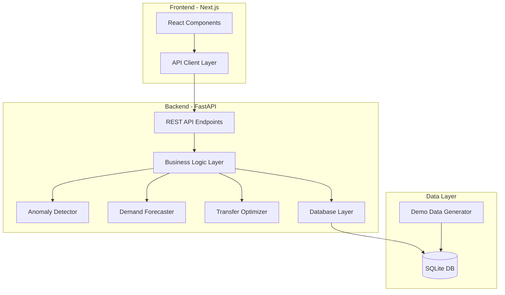

# Optimus Inventory Health Dashboard - Technical Architecture

## Executive Summary

A full-stack inventory management dashboard that predicts stockouts, detects anomalies/shrink, and recommends cross-store transfers to optimize inventory health across multiple retail locations.

**Key Differentiators:**
1. **Anomaly Detection + Confidence Scoring**: Flags unexplained inventory drops and provides an "inventory accuracy confidence" score (0-100)
2. **Cross-Store Transfer Optimizer**: Recommends inter-store transfers before placing new purchase orders, reducing waste and stockouts

**Tech Stack:**
- **Frontend**: Next.js 14 (App Router) + TypeScript + Tailwind CSS + Recharts
- **Backend**: FastAPI (Python 3.11+) + SQLAlchemy + Pydantic
- **Database**: SQLite (for fast hackathon setup)
- **Deployment**: Docker Compose (one-command startup)
- **Testing**: pytest (backend) + Jest (frontend)

---

## Architecture Overview



---

## System Components

### 1. Database Schema

**Core Tables:**

```sql
-- Stores
CREATE TABLE stores (
    id INTEGER PRIMARY KEY,
    name TEXT NOT NULL,
    location TEXT,
    latitude REAL,
    longitude REAL
);

-- SKUs (Stock Keeping Units)
CREATE TABLE skus (
    id INTEGER PRIMARY KEY,
    name TEXT NOT NULL,
    category TEXT,
    unit TEXT,
    cost REAL,
    price REAL,
    is_perishable BOOLEAN DEFAULT 0
);

-- Inventory Snapshots (daily)
CREATE TABLE inventory_snapshots (
    id INTEGER PRIMARY KEY,
    store_id INTEGER NOT NULL,
    sku_id INTEGER NOT NULL,
    ts_date DATE NOT NULL,
    on_hand INTEGER NOT NULL,
    FOREIGN KEY (store_id) REFERENCES stores(id),
    FOREIGN KEY (sku_id) REFERENCES skus(id),
    UNIQUE(store_id, sku_id, ts_date)
);

-- Daily Sales
CREATE TABLE sales_daily (
    id INTEGER PRIMARY KEY,
    store_id INTEGER NOT NULL,
    sku_id INTEGER NOT NULL,
    ts_date DATE NOT NULL,
    qty_sold INTEGER NOT NULL,
    FOREIGN KEY (store_id) REFERENCES stores(id),
    FOREIGN KEY (sku_id) REFERENCES skus(id),
    UNIQUE(store_id, sku_id, ts_date)
);

-- Daily Receipts (incoming stock)
CREATE TABLE receipts_daily (
    id INTEGER PRIMARY KEY,
    store_id INTEGER NOT NULL,
    sku_id INTEGER NOT NULL,
    ts_date DATE NOT NULL,
    qty_received INTEGER NOT NULL,
    FOREIGN KEY (store_id) REFERENCES stores(id),
    FOREIGN KEY (sku_id) REFERENCES skus(id)
);

-- Transfers between stores
CREATE TABLE transfers (
    id INTEGER PRIMARY KEY,
    from_store_id INTEGER NOT NULL,
    to_store_id INTEGER NOT NULL,
    sku_id INTEGER NOT NULL,
    qty INTEGER NOT NULL,
    status TEXT DEFAULT 'draft',  -- draft, approved, in_transit, received
    created_at TIMESTAMP DEFAULT CURRENT_TIMESTAMP,
    received_at TIMESTAMP,
    FOREIGN KEY (from_store_id) REFERENCES stores(id),
    FOREIGN KEY (to_store_id) REFERENCES stores(id),
    FOREIGN KEY (sku_id) REFERENCES skus(id)
);

-- Cycle Counts (physical inventory checks)
CREATE TABLE cycle_counts (
    id INTEGER PRIMARY KEY,
    store_id INTEGER NOT NULL,
    sku_id INTEGER NOT NULL,
    ts_date DATE NOT NULL,
    counted_qty INTEGER NOT NULL,
    FOREIGN KEY (store_id) REFERENCES stores(id),
    FOREIGN KEY (sku_id) REFERENCES skus(id)
);

-- Suppliers
CREATE TABLE suppliers (
    id INTEGER PRIMARY KEY,
    name TEXT NOT NULL,
    avg_lead_time_days INTEGER,
    lead_time_std_days INTEGER
);

-- SKU-Supplier relationship
CREATE TABLE sku_supplier (
    sku_id INTEGER NOT NULL,
    supplier_id INTEGER NOT NULL,
    case_pack INTEGER,
    min_order_qty INTEGER,
    PRIMARY KEY (sku_id, supplier_id),
    FOREIGN KEY (sku_id) REFERENCES skus(id),
    FOREIGN KEY (supplier_id) REFERENCES suppliers(id)
);

-- Anomaly Events (detected issues)
CREATE TABLE anomaly_events (
    id INTEGER PRIMARY KEY,
    store_id INTEGER NOT NULL,
    sku_id INTEGER NOT NULL,
    ts_date DATE NOT NULL,
    residual REAL NOT NULL,
    severity TEXT,  -- low, medium, high, critical
    explanation_hint TEXT,
    FOREIGN KEY (store_id) REFERENCES stores(id),
    FOREIGN KEY (sku_id) REFERENCES skus(id)
);

-- Transfer Recommendations
CREATE TABLE transfer_recommendations (
    id INTEGER PRIMARY KEY,
    from_store_id INTEGER NOT NULL,
    to_store_id INTEGER NOT NULL,
    sku_id INTEGER NOT NULL,
    qty INTEGER NOT NULL,
    urgency_score REAL,
    rationale TEXT,
    created_at TIMESTAMP DEFAULT CURRENT_TIMESTAMP,
    status TEXT DEFAULT 'pending',  -- pending, accepted, rejected
    FOREIGN KEY (from_store_id) REFERENCES stores(id),
    FOREIGN KEY (to_store_id) REFERENCES stores(id),
    FOREIGN KEY (sku_id) REFERENCES skus(id)
);

-- Store Distance Matrix (for transfer optimization)
CREATE TABLE store_distances (
    from_store_id INTEGER NOT NULL,
    to_store_id INTEGER NOT NULL,
    distance_km REAL,
    transfer_cost REAL,
    PRIMARY KEY (from_store_id, to_store_id),
    FOREIGN KEY (from_store_id) REFERENCES stores(id),
    FOREIGN KEY (to_store_id) REFERENCES stores(id)
);
```

---

### 2. Core Business Logic

#### A. Demand Forecasting Engine

**Algorithm: Weighted Moving Average with Day-of-Week Patterns**

```python
def calculate_demand_forecast(store_id: int, sku_id: int, window_days: int = 28):
    """
    Calculate demand forecast using weighted moving average.
    Accounts for weekday vs weekend patterns.
    """
    # Get historical sales
    sales_history = get_sales_history(store_id, sku_id, window_days)
    
    # Separate weekday vs weekend
    weekday_sales = [s for s in sales_history if s.date.weekday() < 5]
    weekend_sales = [s for s in sales_history if s.date.weekday() >= 5]
    
    # Calculate weighted averages (recent days weighted higher)
    weekday_avg = weighted_average(weekday_sales, decay=0.95)
    weekend_avg = weighted_average(weekend_sales, decay=0.95)
    
    # Determine if next day is weekday or weekend
    next_day = datetime.now() + timedelta(days=1)
    is_weekday = next_day.weekday() < 5
    
    daily_demand = weekday_avg if is_weekday else weekend_avg
    
    # Calculate demand variability (for safety stock)
    demand_std = calculate_std_dev(sales_history)
    
    return {
        'daily_demand': daily_demand,
        'demand_std': demand_std,
        'weekday_avg': weekday_avg,
        'weekend_avg': weekend_avg
    }
```

**Metrics:**
- **Days of Cover** = `on_hand / max(daily_demand, 0.1)`
- **Stockout Risk** = Probability of stockout in next N days based on demand variability
- **Reorder Point** = `(daily_demand * lead_time_days) + safety_stock`

---

#### B. Anomaly Detection & Confidence Scoring

**Algorithm: Residual-Based Anomaly Detection**

```python
def detect_anomalies(store_id: int, sku_id: int, date: datetime):
    """
    Detect inventory anomalies by comparing expected vs actual changes.
    """
    # Get inventory snapshots
    today_inv = get_inventory(store_id, sku_id, date)
    yesterday_inv = get_inventory(store_id, sku_id, date - timedelta(days=1))
    
    # Calculate expected change
    receipts = get_receipts(store_id, sku_id, date)
    sales = get_sales(store_id, sku_id, date)
    transfers_in = get_transfers_in(store_id, sku_id, date)
    transfers_out = get_transfers_out(store_id, sku_id, date)
    
    expected_delta = receipts - sales + transfers_in - transfers_out
    
    # Calculate actual change
    actual_delta = today_inv - yesterday_inv
    
    # Calculate residual (unexplained change)
    residual = actual_delta - expected_delta
    
    # Flag anomaly if residual exceeds threshold
    threshold = -5  # units (configurable)
    
    if residual < threshold:
        severity = classify_severity(residual)
        explanation = generate_explanation(residual, receipts, sales, transfers_in, transfers_out)
        
        return {
            'is_anomaly': True,
            'residual': residual,
            'severity': severity,
            'explanation': explanation,
            'expected_delta': expected_delta,
            'actual_delta': actual_delta
        }
    
    return {'is_anomaly': False}
```

**Inventory Accuracy Confidence Score (0-100):**

```python
def calculate_confidence_score(store_id: int, sku_id: int):
    """
    Calculate inventory accuracy confidence score.
    Starts at 100, deducts points for various risk factors.
    """
    score = 100.0
    
    # Get anomalies in last 30 days
    anomalies = get_anomalies(store_id, sku_id, days=30)
    
    # Deduct for anomaly frequency
    anomaly_count = len(anomalies)
    score -= min(anomaly_count * 5, 30)  # Max -30 points
    
    # Deduct for anomaly magnitude
    total_residual = sum(abs(a.residual) for a in anomalies)
    score -= min(total_residual * 0.5, 20)  # Max -20 points
    
    # Deduct for days since last cycle count
    last_count = get_last_cycle_count(store_id, sku_id)
    if last_count:
        days_since_count = (datetime.now() - last_count.ts_date).days
        score -= min(days_since_count * 0.3, 20)  # Max -20 points
    else:
        score -= 30  # Never counted
    
    # Deduct for perishable items without recent counts
    if is_perishable(sku_id) and days_since_count > 7:
        score -= 10
    
    # Deduct for consistent negative residuals (shrink pattern)
    recent_anomalies = anomalies[-5:]
    negative_count = sum(1 for a in recent_anomalies if a.residual < 0)
    if negative_count >= 3:
        score -= 15  # Systematic shrink pattern
    
    return max(0, min(100, score))
```

**Explanation Generator:**

```python
def generate_explanation(residual, receipts, sales, transfers_in, transfers_out):
    """
    Generate plain-English explanation for anomaly.
    """
    expected = receipts - sales + transfers_in - transfers_out
    
    if residual < -10:
        if sales > 0 and receipts == 0:
            return f"Expected {expected} units after {sales} sales, but inventory dropped by {abs(residual)} more units. Possible shrink or unrecorded sales."
        elif receipts > 0:
            return f"Received {receipts} units but inventory only increased by {expected + residual}. Possible receiving error or damage."
        else:
            return f"Inventory dropped by {abs(residual)} units with no recorded transactions. Likely theft or system error."
    
    return "Minor discrepancy within normal variance."
```

---

#### C. Cross-Store Transfer Optimizer

**Algorithm: Distance-Weighted Greedy Matching**

```python
def generate_transfer_recommendations(target_cover_days: int = 10, safety_buffer_days: int = 2):
    """
    Generate transfer recommendations to prevent stockouts.
    Prioritizes nearby stores and high-urgency receivers.
    """
    recommendations = []
    
    # Get all store-SKU combinations
    inventory_states = get_all_inventory_states()
    
    # Group by SKU
    for sku_id in get_all_skus():
        receivers = []
        donors = []
        
        for state in inventory_states:
            if state.sku_id != sku_id:
                continue
            
            # Calculate need and surplus
            daily_demand = state.daily_demand
            target_on_hand = daily_demand * target_cover_days
            buffer_on_hand = daily_demand * safety_buffer_days
            
            need = max(0, target_on_hand - state.on_hand)
            surplus = max(0, state.on_hand - (target_on_hand + buffer_on_hand))
            
            if need > 0:
                urgency = calculate_urgency(state.days_of_cover, daily_demand)
                receivers.append({
                    'store_id': state.store_id,
                    'need': need,
                    'urgency': urgency,
                    'days_of_cover': state.days_of_cover
                })
            
            if surplus > 0:
                donors.append({
                    'store_id': state.store_id,
                    'surplus': surplus,
                    'days_of_cover': state.days_of_cover
                })
        
        # Sort receivers by urgency (lowest days-of-cover first)
        receivers.sort(key=lambda x: x['urgency'], reverse=True)
        
        # Match receivers with donors
        for receiver in receivers:
            if receiver['need'] <= 0:
                continue
            
            # Find best donor (highest surplus, closest distance)
            best_donor = find_best_donor(
                receiver['store_id'],
                donors,
                sku_id
            )
            
            if best_donor:
                transfer_qty = min(receiver['need'], best_donor['surplus'])
                
                # Generate rationale
                rationale = f"Store {receiver['store_id']} will stock out in {receiver['days_of_cover']:.1f} days. Store {best_donor['store_id']} has {best_donor['days_of_cover']:.1f} days excess. Transfer {transfer_qty} units prevents stockout."
                
                recommendations.append({
                    'from_store_id': best_donor['store_id'],
                    'to_store_id': receiver['store_id'],
                    'sku_id': sku_id,
                    'qty': transfer_qty,
                    'urgency_score': receiver['urgency'],
                    'rationale': rationale
                })
                
                # Update donor surplus
                best_donor['surplus'] -= transfer_qty
                receiver['need'] -= transfer_qty
    
    return recommendations

def find_best_donor(receiver_store_id, donors, sku_id):
    """
    Find best donor store based on surplus and distance.
    """
    if not donors:
        return None
    
    # Score each donor
    scored_donors = []
    for donor in donors:
        if donor['surplus'] <= 0:
            continue
        
        distance = get_store_distance(donor['store_id'], receiver_store_id)
        
        # Score = surplus / (1 + distance_penalty)
        distance_penalty = distance / 100  # Normalize distance
        score = donor['surplus'] / (1 + distance_penalty)
        
        scored_donors.append({
            **donor,
            'score': score
        })
    
    if not scored_donors:
        return None
    
    # Return highest scoring donor
    return max(scored_donors, key=lambda x: x['score'])
```

---

### 3. API Endpoints

**FastAPI REST API:**

```python
# Overview & Alerts
GET /api/overview
    Query params: store_id (optional), risk_only (bool), min_confidence (int)
    Returns: List of inventory states with alerts

# SKU Detail
GET /api/sku/{store_id}/{sku_id}
    Returns: Detailed SKU info with forecast, anomalies, recommendations

# Transfer Recommendations
GET /api/transfers/recommendations
    Query params: min_urgency (float), store_id (optional)
    Returns: List of recommended transfers

# Create Transfer Draft
POST /api/transfers/draft
    Body: { recommendation_id: int } or { from_store_id, to_store_id, sku_id, qty }
    Returns: Created transfer record

# Update Transfer Status
PATCH /api/transfers/{transfer_id}
    Body: { status: "approved" | "in_transit" | "received" }
    Returns: Updated transfer

# Demo Data Management
POST /api/demo/regenerate
    Body: { num_stores: int, num_skus: int, days_history: int }
    Returns: { message: "Data regenerated", stats: {...} }

GET /api/demo/stats
    Returns: Current database statistics

# Authentication (Mock)
POST /api/auth/login
    Body: { username: str, password: str }
    Returns: { token: str, user: {...} }

# Health Check
GET /api/health
    Returns: { status: "ok", version: "1.0.0" }
```

---

### 4. Frontend Pages

#### Page 1: Overview Dashboard

**Route:** `/`

**Components:**
- **Top Alerts Bar**: Critical stockouts, low confidence scores, transfer opportunities
- **Filters**: Store selector, category filter, risk level, confidence threshold
- **Inventory Health Table**:
  - Columns: Store, SKU, On-hand, Demand/day, Days cover, Stockout date, Confidence, Action
  - Color coding: Red (< 3 days), Yellow (3-7 days), Green (> 7 days)
  - Sortable and filterable

**Key Features:**
- Real-time search
- Export to CSV
- Bulk actions (create transfers, schedule counts)

---

#### Page 2: SKU Detail

**Route:** `/sku/[storeId]/[skuId]`

**Components:**
- **Header Card**: SKU name, category, current on-hand, confidence score
- **Forecast Chart**: Line chart showing on-hand, sales, receipts, forecast
- **Anomaly Timeline**: Bar chart showing residuals over time with flagged events
- **Recommendation Cards**:
  - Reorder suggestion (date, qty, supplier)
  - Transfer suggestion (from which store, qty)
  - Cycle count recommendation (if confidence low)
- **Anomaly Explanations**: List of recent anomalies with plain-English explanations

**Key Features:**
- Date range selector
- Forecast window selector (7/14/28 days)
- "Create Transfer" and "Schedule Count" actions

---

#### Page 3: Transfers

**Route:** `/transfers`

**Components:**
- **Tabs**: Recommendations, Drafts, In Transit, Completed
- **Recommendations List**:
  - Grouped by receiver store
  - Each item shows: SKU, from/to stores, qty, urgency, rationale
  - "Create Draft" button
- **Transfer Status Cards**: Visual workflow (draft → approved → in transit → received)

**Key Features:**
- Bulk approve transfers
- Filter by urgency, store, SKU
- Distance/cost estimates

---

#### Page 4: Data Admin

**Route:** `/admin`

**Components:**
- **Demo Data Generator**:
  - Form: num_stores, num_skus, days_history
  - "Regenerate Data" button
  - Progress indicator
- **Database Stats**: Current record counts, last updated
- **CSV Upload** (optional): Upload sales/inventory data
- **Mock Users**: List of hardcoded users for auth demo

**Key Features:**
- One-click demo reset
- Seed data with guaranteed anomalies and transfer opportunities

---

### 5. Demo Data Generator

**Requirements:**
- 5 stores (Atlanta, Boston, Chicago, Denver, Seattle)
- 200 SKUs across categories (Beverages, Snacks, Dairy, Produce, Frozen, etc.)
- 60 days of history
- Realistic patterns:
  - Weekday vs weekend sales variation
  - Seasonal trends (slight upward/downward)
  - Random noise (±10%)
- Injected anomalies:
  - 10-15 shrink events (unexplained drops)
  - 3-5 receiving errors (expected receipt didn't arrive)
  - 2-3 systematic shrink patterns (consistent negative residuals)
- Transfer opportunities:
  - 5-8 scenarios where one store is overstocked and another near stockout
- Cycle counts:
  - Random counts for 20% of SKUs in last 30 days

**Implementation:**

```python
def generate_demo_data():
    """
    Generate realistic demo data with patterns and anomalies.
    """
    # Create stores with locations
    stores = create_stores([
        {'name': 'Atlanta Store', 'lat': 33.7490, 'lon': -84.3880},
        {'name': 'Boston Store', 'lat': 42.3601, 'lon': -71.0589},
        {'name': 'Chicago Store', 'lat': 41.8781, 'lon': -87.6298},
        {'name': 'Denver Store', 'lat': 39.7392, 'lon': -104.9903},
        {'name': 'Seattle Store', 'lat': 47.6062, 'lon': -122.3321}
    ])
    
    # Calculate store distances
    generate_store_distances(stores)
    
    # Create SKUs
    skus = create_skus(200, categories=[
        'Beverages', 'Snacks', 'Dairy', 'Produce', 
        'Frozen', 'Bakery', 'Meat', 'Household'
    ])
    
    # Generate 60 days of history
    for day in range(60, 0, -1):
        date = datetime.now() - timedelta(days=day)
        
        for store in stores:
            for sku in skus:
                # Generate sales with weekday/weekend pattern
                base_demand = random.uniform(5, 50)
                is_weekend = date.weekday() >= 5
                weekend_multiplier = 1.3 if is_weekend else 1.0
                
                sales = int(base_demand * weekend_multiplier * random.uniform(0.9, 1.1))
                
                # Generate receipts (every 7-14 days)
                receipts = 0
                if random.random() < 0.1:
                    receipts = int(base_demand * 7 * random.uniform(0.8, 1.2))
                
                # Update inventory
                update_inventory(store, sku, date, sales, receipts)
    
    # Inject anomalies
    inject_shrink_events(stores, skus, count=12)
    inject_receiving_errors(stores, skus, count=4)
    inject_systematic_shrink(stores, skus, count=3)
    
    # Create transfer opportunities
    create_transfer_scenarios(stores, skus, count=7)
    
    # Generate cycle counts
    generate_cycle_counts(stores, skus, coverage=0.2)
    
    return {
        'stores': len(stores),
        'skus': len(skus),
        'days': 60,
        'anomalies_injected': 19,
        'transfer_opportunities': 7
    }
```

---

### 6. Docker Compose Setup

**File: `docker-compose.yml`**

```yaml
version: '3.8'

services:
  backend:
    build:
      context: ./backend
      dockerfile: Dockerfile
    ports:
      - "8000:8000"
    volumes:
      - ./backend:/app
      - sqlite-data:/app/data
    environment:
      - DATABASE_URL=sqlite:///data/inventory.db
      - CORS_ORIGINS=http://localhost:3000
    command: uvicorn app.main:app --host 0.0.0.0 --port 8000 --reload
    healthcheck:
      test: ["CMD", "curl", "-f", "http://localhost:8000/api/health"]
      interval: 30s
      timeout: 10s
      retries: 3

  frontend:
    build:
      context: ./frontend
      dockerfile: Dockerfile
    ports:
      - "3000:3000"
    volumes:
      - ./frontend:/app
      - /app/node_modules
      - /app/.next
    environment:
      - NEXT_PUBLIC_API_URL=http://localhost:8000
    depends_on:
      - backend
    command: npm run dev

volumes:
  sqlite-data:
```

**One-command startup:**
```bash
docker-compose up --build
```

---

### 7. Project Structure

```
inventory-health-dashboard/
├── docker-compose.yml
├── README.md
├── .env.example
├── plans/
│   └── technical-architecture.md
│
├── backend/
│   ├── Dockerfile
│   ├── requirements.txt
│   ├── pytest.ini
│   ├── app/
│   │   ├── __init__.py
│   │   ├── main.py                 # FastAPI app entry
│   │   ├── config.py               # Configuration
│   │   ├── database.py             # SQLAlchemy setup
│   │   ├── models/
│   │   │   ├── __init__.py
│   │   │   ├── store.py
│   │   │   ├── sku.py
│   │   │   ├── inventory.py
│   │   │   ├── sales.py
│   │   │   ├── transfer.py
│   │   │   └── anomaly.py
│   │   ├── schemas/                # Pydantic models
│   │   │   ├── __init__.py
│   │   │   ├── inventory.py
│   │   │   ├── transfer.py
│   │   │   └── overview.py
│   │   ├── api/
│   │   │   ├── __init__.py
│   │   │   ├── overview.py
│   │   │   ├── sku.py
│   │   │   ├── transfers.py
│   │   │   ├── demo.py
│   │   │   └── auth.py
│   │   ├── services/
│   │   │   ├── __init__.py
│   │   │   ├── forecasting.py      # Demand forecasting
│   │   │   ├── anomaly_detector.py # Anomaly detection
│   │   │   ├── transfer_optimizer.py
│   │   │   └── confidence_scorer.py
│   │   ├── utils/
│   │   │   ├── __init__.py
│   │   │   ├── demo_data.py        # Demo data generator
│   │   │   └── distance.py         # Distance calculations
│   │   └── tests/
│   │       ├── __init__.py
│   │       ├── test_forecasting.py
│   │       ├── test_anomaly.py
│   │       └── test_transfers.py
│   └── data/
│       └── .gitkeep
│
└── frontend/
    ├── Dockerfile
    ├── package.json
    ├── tsconfig.json
    ├── tailwind.config.ts
    ├── next.config.js
    ├── .env.local.example
    ├── public/
    │   └── logo.svg
    ├── src/
    │   ├── app/
    │   │   ├── layout.tsx
    │   │   ├── page.tsx            # Overview dashboard
    │   │   ├── sku/
    │   │   │   └── [storeId]/
    │   │   │       └── [skuId]/
    │   │   │           └── page.tsx
    │   │   ├── transfers/
    │   │   │   └── page.tsx
    │   │   └── admin/
    │   │       └── page.tsx
    │   ├── components/
    │   │   ├── ui/                 # Reusable UI components
    │   │   │   ├── Button.tsx
    │   │   │   ├── Card.tsx
    │   │   │   ├── Table.tsx
    │   │   │   └── Badge.tsx
    │   │   ├── dashboard/
    │   │   │   ├── AlertsBar.tsx
    │   │   │   ├── InventoryTable.tsx
    │   │   │   └── Filters.tsx
    │   │   ├── sku/
    │   │   │   ├── ForecastChart.tsx
    │   │   │   ├── AnomalyTimeline.tsx
    │   │   │   └── RecommendationCard.tsx
    │   │   └── transfers/
    │   │       ├── TransferList.tsx
    │   │       └── TransferCard.tsx
    │   ├── lib/
    │   │   ├── api.ts              # API client
    │   │   ├── types.ts            # TypeScript types
    │   │   └── utils.ts            # Utility functions
    │   └── styles/
    │       └── globals.css
    └── __tests__/
        └── components/
            └── InventoryTable.test.tsx
```

---

## Key Algorithms Summary

### 1. Demand Forecasting
- **Method**: Weighted moving average with weekday/weekend patterns
- **Inputs**: Historical sales (7/14/28 days configurable)
- **Outputs**: Daily demand estimate, demand variability, days-of-cover

### 2. Anomaly Detection
- **Method**: Residual-based detection (expected vs actual inventory change)
- **Threshold**: Configurable (default: -5 units)
- **Severity**: Low, Medium, High, Critical based on magnitude

### 3. Confidence Scoring
- **Base**: 100 points
- **Deductions**:
  - Anomaly frequency: -5 points per event (max -30)
  - Anomaly magnitude: -0.5 per unit (max -20)
  - Days since cycle count: -0.3 per day (max -20)
  - Perishable without count: -10
  - Systematic shrink pattern: -15

### 4. Transfer Optimization
- **Method**: Distance-weighted greedy matching
- **Priority**: Urgency (lowest days-of-cover first)
- **Donor Selection**: Highest surplus, closest distance
- **Constraints**: Don